# Flutter Bài Tập SQLite Chương 11

**Sinh viên:** Đặng Ngọc Hiếu
**MSSV:** 6451071024
**Môn:** Lập Trình Ứng Dụng Trên Thiết Bị Di Động

---

## Cấu Trúc Thư Mục

```
lib/
├── firebase_options.dart
├── main.dart
├── apps/
│   └── app.dart
├── controllers/
│   ├── auth_controller.dart
│   ├── image_controller.dart
│   ├── note_controller.dart
│   ├── student_controller.dart
│   └── task_controller.dart
├── data/
│   ├── models/
│   │   ├── dashboard_item.dart
│   │   ├── note.dart
│   │   ├── shared_image.dart
│   │   ├── student.dart
│   │   └── task.dart
│   ├── repositories/
│   │   ├── auth_repository.dart
│   │   ├── image_repository.dart
│   │   ├── note_repository.dart
│   │   ├── student_repository.dart
│   │   └── task_repository.dart
│   └── services/
│       └── firebase_service.dart
├── utils/
│   ├── constants.dart
│   └── validate.dart
├── view/
│   ├── 1/
│   │   ├── image.png
│   │   └── task_list_view.dart
│   ├── 2/
│   │   ├── home_auth_view.dart
│   │   ├── image.png
│   │   ├── image2.png
│   │   ├── image3.png
│   │   ├── login_view.dart
│   │   └── register_view.dart
│   ├── 3/
│   │   ├── image.png
│   │   ├── image2.png
│   │   ├── student_form_view.dart
│   │   └── student_list_view.dart
│   ├── 4/
│   │   ├── image.png
│   │   ├── image2.png
│   │   ├── shared_image_form_view.dart
│   │   └── shared_image_grid_view.dart
│   ├── 5/
│   │   ├── image.png
│   │   ├── image2.png
│   │   ├── image3.png
│   │   ├── image4.png
│   │   ├── note_form_view.dart
│   │   └── note_list_view.dart
│   ├── 6/
│   ├── 7/
│   ├── 8/
│   ├── 9/
│   ├── 10/
│   └── dashboard/
│       └── dashboard_screen.dart
└── widget/
    ├── alertdialog_custom.dart
    ├── button_custom.dart
    ├── dashboard_card.dart
    └── inputdecoration_custom.dart
```

---

## Danh Sách Bài Tập


### Bài 1: Danh sách công việc cá nhân (To-do List - Firestore CRUD)
- Ảnh 1
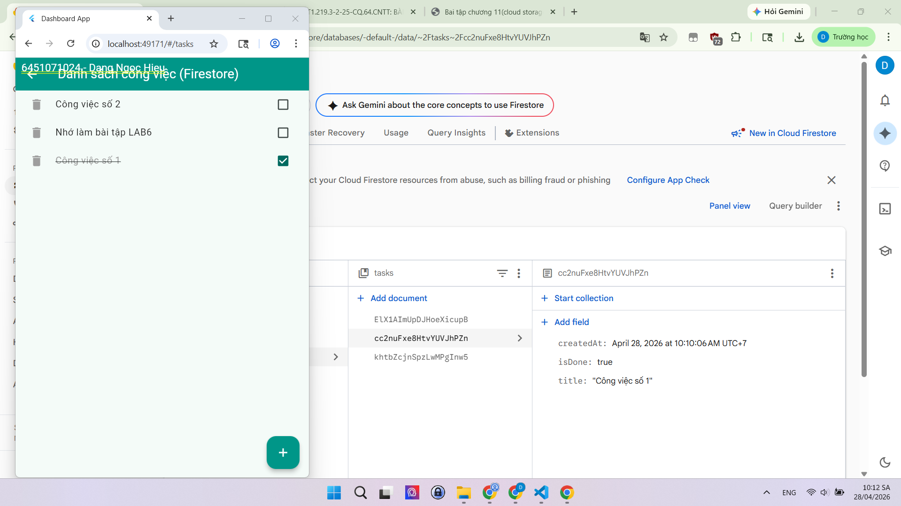

---

### Bài 2:  Ứng dụng đăng ký / đăng nhập (Authentication)
- Ảnh 1
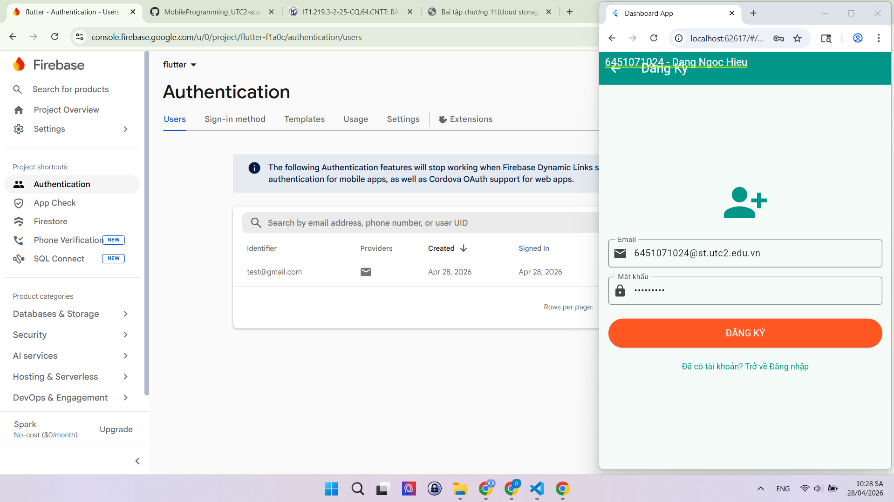

- Ảnh 2
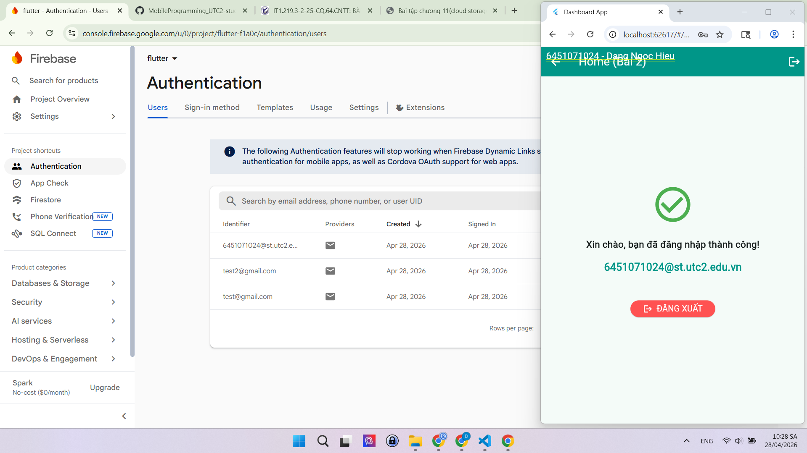

- Ảnh 3
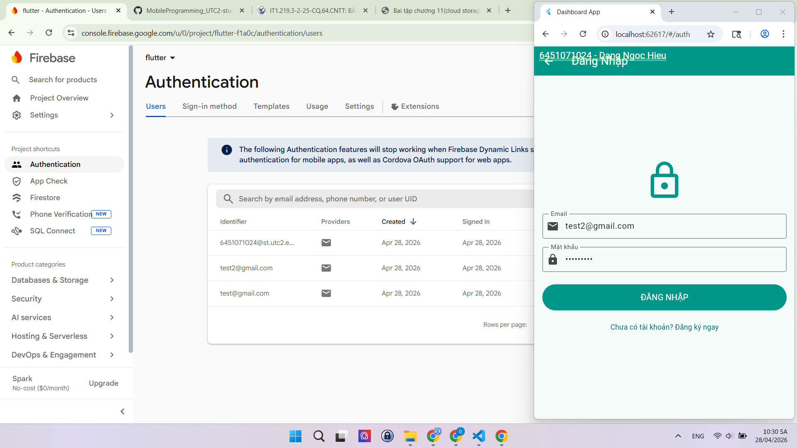
---

### Bài 3: Ứng dụng quản lý sinh viên (Firebase Firestore)
- Ảnh 1
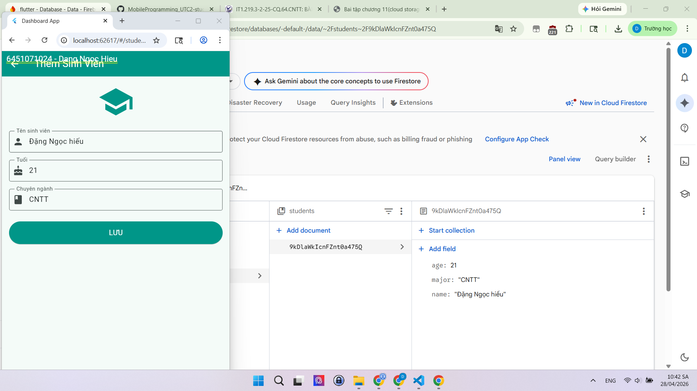

- Ảnh 2
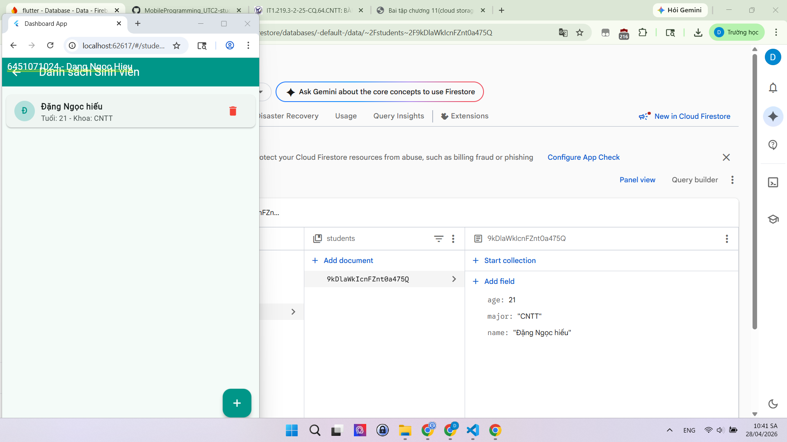

---

### Bài 4: Ứng dụng chia sẻ ảnh (Firebase Storage + Firestore)
- Ảnh 1
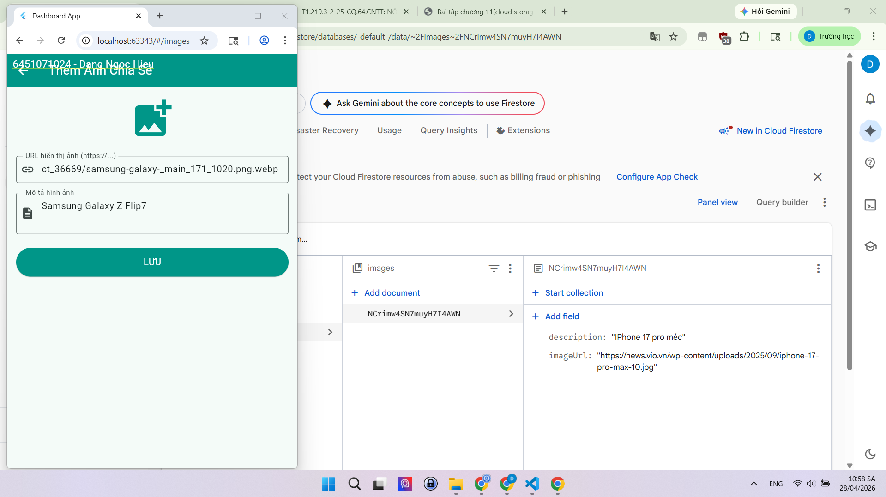

- Ảnh 2
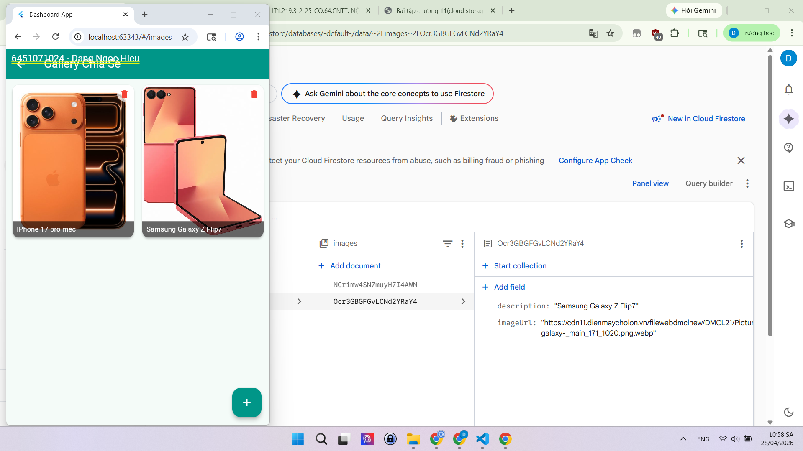

### Bài 5: : Ứng dụng ghi chú cá nhân (CRUD + Offline)
- Ảnh 1
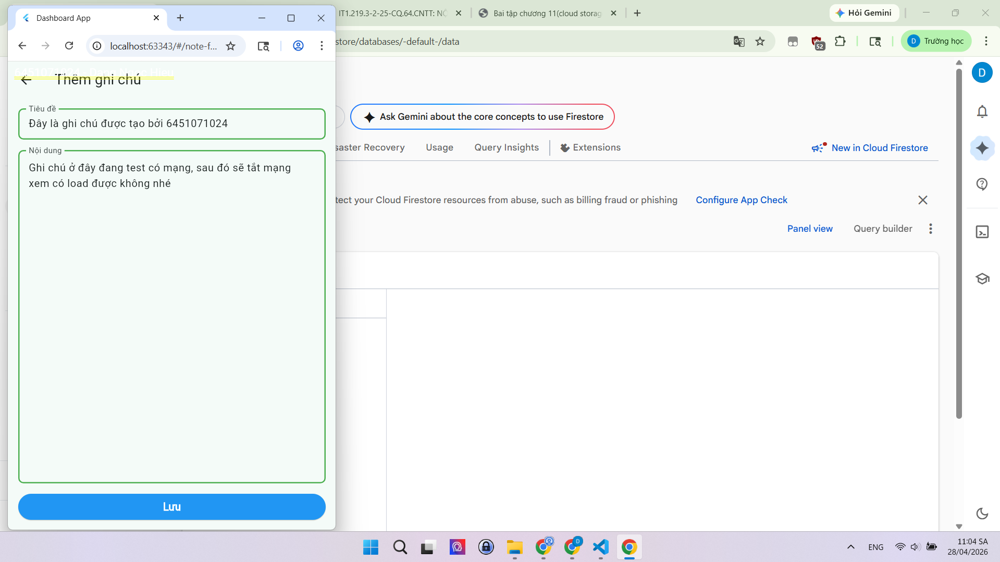

- Ảnh 2
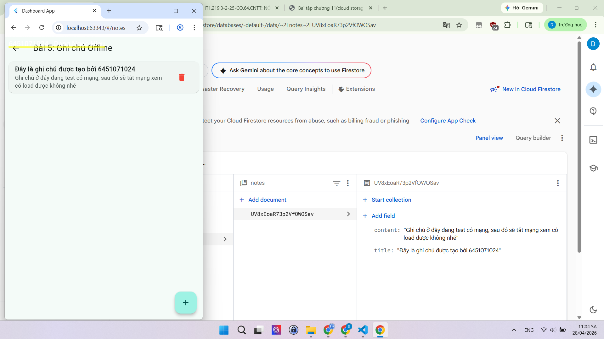

- Ảnh 3
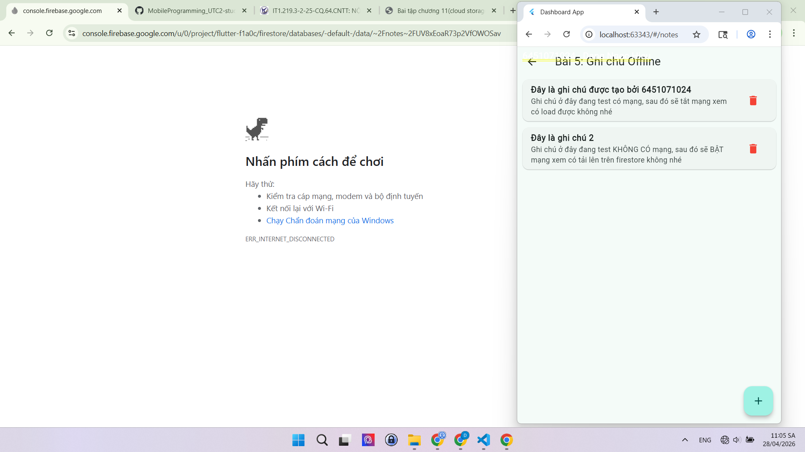

- Ảnh 4
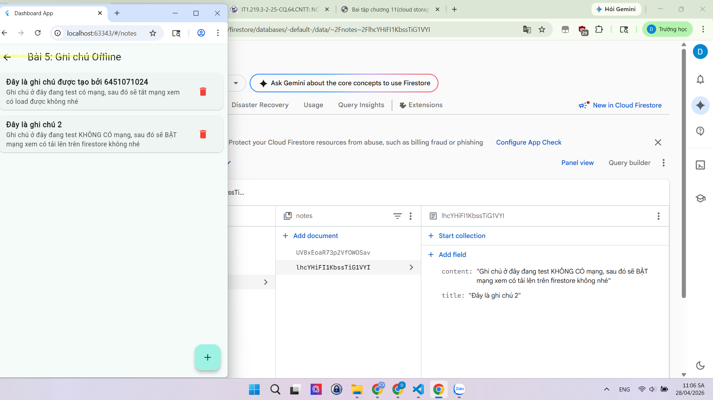

